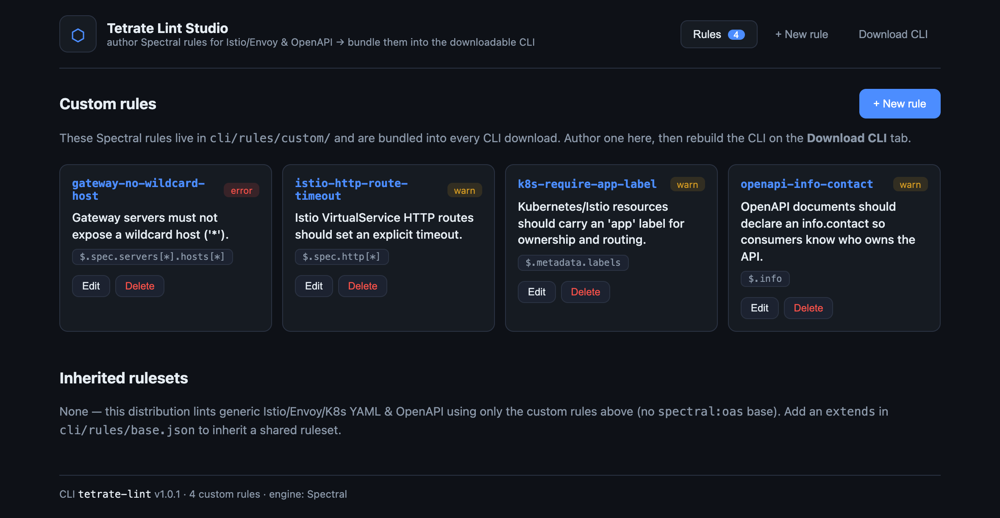
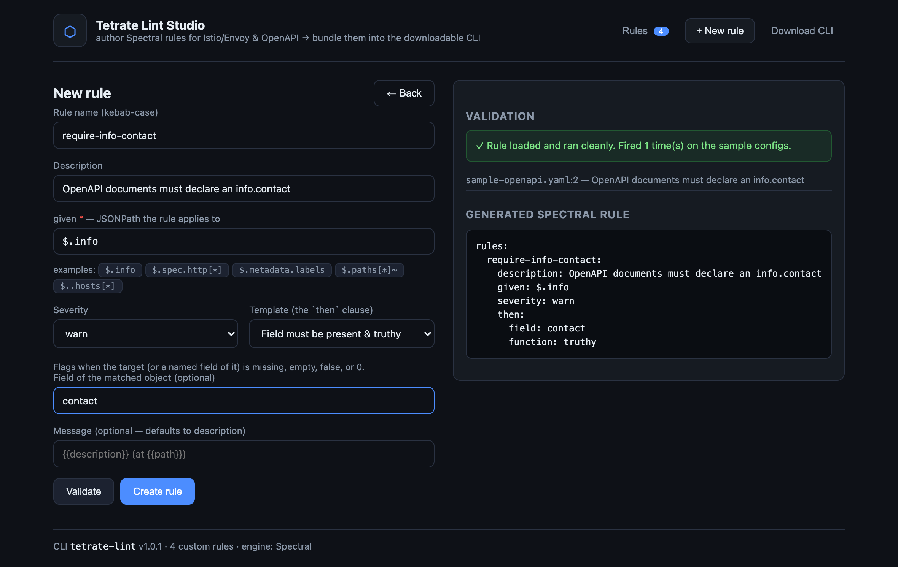

# Tetrate Lint Studio

Author **custom [Spectral](https://github.com/stoplightio/spectral) lint rules** for Tetrate
service-mesh & API configs (Istio / Envoy / Kubernetes YAML + OpenAPI) in a web UI, validate them
against sample configs, and **bundle them into a downloadable CLI** that anyone on your team can
install via **npm** or **Docker** — with your rules baked in, no separate ruleset to wire up.

> **▶ Live UI demo:** https://sreenivas-sadhu-prabhakara.github.io/tetrate-lint-studio/
> — a static, backend-free preview. Authoring and building need the backend, so clone the repo and
> run `npm start` for the real thing.

This is the same Rule Studio pattern as
[apigee-lint-with-custom-rules-ui](https://github.com/Sreenivas-Sadhu-Prabhakara/apigee-lint-with-custom-rules-ui),
but the engine is **Spectral** instead of apigeelint, so it lints YAML/JSON configs and API specs.

## Screenshots

**Rule library** — custom Spectral rules, bundled into every CLI download:



**Authoring + live validation** — pick a template, set a JSONPath `given`, validate against sample
Istio/Gateway/OpenAPI files (runs the *real* CLI), and review the generated Spectral rule:



## What's here

| Path | What it is |
| ---- | ---------- |
| `cli/` | `tetrate-lint` — a thin wrapper over `@stoplight/spectral-cli` that auto-applies a ruleset compiled from `rules/custom/*.json`. The publishable/downloadable artifact. |
| `server/` | Node/Express backend. Lists rules, generates + validates Spectral rules, writes them into `cli/rules/custom/`, and packs/builds the CLI. |
| `ui/` | React (Vite) Studio — browse rules, author new ones, build the download. Has a demo mode for static hosting. |
| `dist/` | Output: packed CLI tarballs. |
| `Dockerfile` | Builds a self-contained CLI image. |
| `docs/` | [Architecture](docs/architecture.md) · [Adding rules](docs/adding-rules.md) · [Downloading the CLI](docs/downloading-the-cli.md) |

## Quick start

```bash
npm run setup                      # install cli + server + ui

npm run dev:server                 # backend on http://localhost:4700
npm run dev:ui                     # UI on http://localhost:5700 (proxies API)
# or:
npm start                          # build UI + serve everything on http://localhost:4700
```

Create a rule, then **Download CLI → Build new download** — the tarball in `dist/` contains your rule.

## The core idea

Spectral already supports custom rulesets. The studio adds two things: a **UI to author rules**
(guided templates → `given`/`then`/`severity`), and a **CLI wrapper that bundles those rules and
applies them by default** — so a downloaded CLI just *has* your org's rules. Opt out per-run with
`--no-bundled-rules`.

## Attribution

`cli/` wraps [stoplightio/spectral](https://github.com/stoplightio/spectral) (Apache-2.0), installed
as a dependency. This project is MIT licensed.
